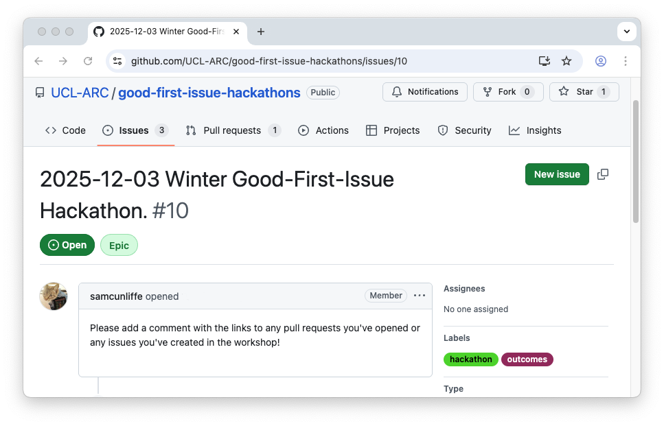

   <!-- aesthetic vspace so the title isn't too close to the UCL banner -->

# ARC-CCMI Winter Open-source good-first-issue hackathon

### [@samcunliffe](https://github.com/samcunliffe) [@mscroggs](https://github.com/mscroggs) [@dpshelio](https://github.com/dpshelio/) [@paddyroddy](https://github.com/paddyroddy) [@connoraird](https://github.com/connoraird)

2025-12-03

---

<!--
paginate: true
-->

<!--

# [bit.ly/first-open](https://bit.ly/first-open)

---

-->

# Thank you for coming!

The goal of this hackathon is to help new people make their first open-source contribution.
This could be:

- Fixing a bug. Adding a test.
- Improving documentation.
- Fixing broken links on a website.
- ...

A second goal is to work with someone you haven't worked with before!

## Plan of action

Break up into small groups or pairs. Find something. Work on it.

---

# Rough outline of the "how"...

Find a project and an issue you think you can fix. Looking for the  can help. Then read their contributor guidelines.

If a project doesn't have contributor guidelines, a typical workflow is:

1. [Fork] the project's repository, clone (`git clone`) your fork onto your laptop.
2. Fix the issue.
3. Commit (`git commit`) your fix, push to your fork (`git push`).
4. Open a [pull request].

Shout if you need help! There are at least 4 helpers around!

[Fork]: https://docs.github.com/en/pull-requests/collaborating-with-pull-requests/working-with-forks/fork-a-repo
[pull request]: https://docs.github.com/en/pull-requests/collaborating-with-pull-requests/proposing-changes-to-your-work-with-pull-requests/about-pull-requests

---

# If you don't know what to work on

- Is there any software you actively use that you could contribute to?
- Browse [ForGoodFirstIssue](https://forgoodfirstissue.github.com).
- We have some ideas:
  - [The Carpentries]: Markdown and HTML teaching material.
  - [A big link to several UCL-related projects](https://github.com/search?q=repo%3AUCL%2Fopen-source+repo%3AFEniCS%2Fdolfinx+repo%3AFEniCS%2Fdolfinx+repo%3Aswcarpentry%2Fgit-novice+repo%3Aswcarpentry%2Fpython-novice-inflammation+repo%3Aswcarpentry%2Fr-novice-inflammation+repo%3Aneuroinformatics-unit%2Ffancylog+label%3A%22good+first+issue%22++repo%3Asunpy%2Fsunpy+-label%3A%22Effort+High%22+-label%3A%22Effort+Medium%22+is%3Aopen&type=issues).
  - [A testing issue](https://github.com/SciKit-Surgery/scikit-surgerynditracker/issues/62), [another testing issue](https://github.com/glass-dev/glass/issues/839)

[The Carpentries]: https://github.com/search?q=label%3A%22good+first+issue%22+is%3Aopen+org%3Aswcarpentry+org%3Acarpentries+org%3Adatacarpentry+org%3Alibrarycarpentry&type=issues

---

# End

If you're comfortable, please add a comment to [this issue](https://github.com/UCL-ARC/good-first-issue-hackathons/issues/10) with the URL(s) to any pull requests or issues you've created in this workshop!

Thanks for coming!
